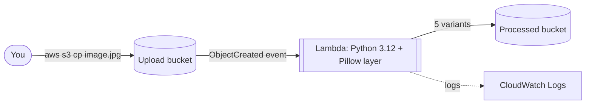
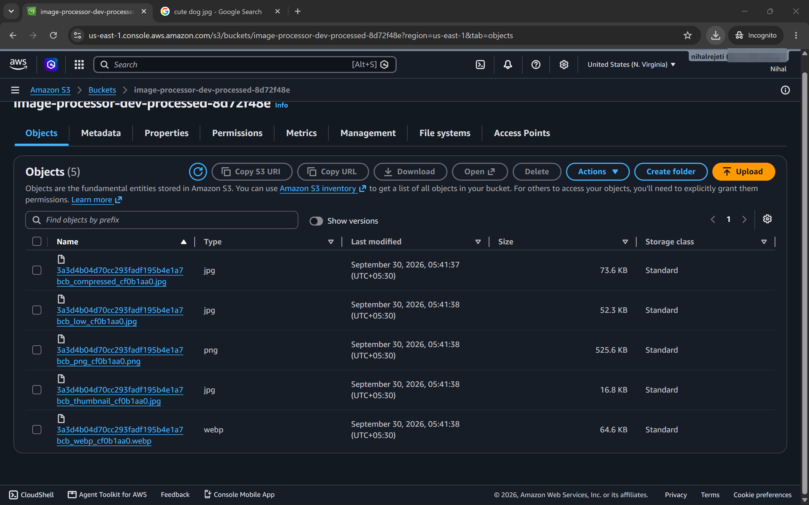
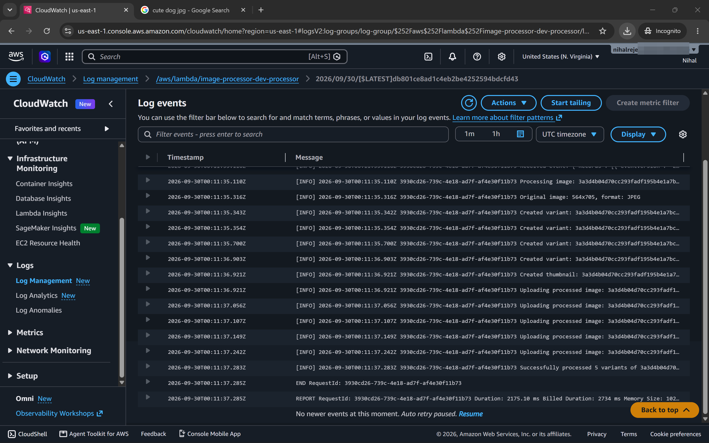

# Serverless Image Processing Pipeline

Upload one image to an S3 bucket. A Lambda function runs by itself and saves five smaller, web-ready versions of it in a second bucket. All the AWS resources are created with Terraform.


## How it works



1. You upload an image to the **upload bucket**.
2. S3 sends an `ObjectCreated` event to the **Lambda function**.
3. The function downloads the image, makes the variants with [Pillow](https://python-pillow.org/), and saves them in the **processed bucket**.
4. Logs go to **CloudWatch** (kept for 7 days).

The two buckets are separate on purpose, so the function can never trigger itself in a loop.

## What you get for each upload

Every image produces these five files in the processed bucket. The name pattern is `<original-name>_<suffix>_<8-char-id>.<ext>`.

| Suffix | Format | Details | Example size¹ |
|---|---|---|---|
| `compressed` | JPEG | quality 85 | 73.6 KB |
| `low` | JPEG | quality 60 (smaller file) | 52.3 KB |
| `webp` | WebP | quality 85 | 64.6 KB |
| `png` | PNG | optimized | 525.6 KB |
| `thumbnail` | JPEG | fits inside 300×300, keeps the aspect ratio | 16.8 KB |

¹ From the test run shown in [Results](#results), using one 564×705 JPEG. Your sizes will differ.

Other behavior:

- Images bigger than 4096 px on either side are scaled down first.
- Images with transparency (PNG, etc.) are put on a white background, because JPEG has no transparency.
- Each output file has the original key stored in its S3 metadata (`original-key`).

## Tech stack

| Area | Tool |
|---|---|
| Cloud | AWS |
| Compute | Lambda (Python 3.12, 1024 MB, 60 s timeout) |
| Storage | S3 (versioning on, public access blocked, SSE-S3 encryption) |
| Logs | CloudWatch Logs |
| Infrastructure as Code | Terraform (AWS provider `~> 6.0`) |
| Image library | Pillow 10.4.0, packaged as a Lambda Layer |
| CI | GitHub Actions |

## Security

- Both buckets block all public access and encrypt objects with AES-256 (SSE-S3).
- The Lambda role can only **read** from the upload bucket and **write** to the processed bucket. Log permissions are limited to the deployment region.
- Nothing is public. There is no API and no website, so the only way in is an S3 upload with your AWS credentials.

## Project structure

```
.
├── lambda/
│   ├── lambda_function.py      # The image processing code
│   └── requirements.txt        # Pillow version
├── terraform/
│   ├── main.tf                 # Buckets, IAM, Lambda, layer, S3 trigger
│   ├── variables.tf            # Region, environment, project name, ...
│   ├── outputs.tf              # Bucket names, upload command
│   └── provider.tf             # Provider versions and default tags
├── scripts/
│   ├── build_layer_docker.sh   # Builds the Pillow layer (Linux x86_64) in Docker
│   ├── deploy.sh               # Build layer + terraform init/plan/apply
│   └── destroy.sh              # Empty the buckets + terraform destroy
├── docs/screenshots/           # Images used in this README
└── .github/workflows/
    └── terraform-ci.yml        # terraform fmt + validate
```

## Getting started

### What you need

- An AWS account and the [AWS CLI](https://aws.amazon.com/cli/), set up with `aws configure`
- [Terraform](https://developer.hashicorp.com/terraform/install) 1.0 or newer
- [Docker](https://docs.docker.com/get-docker/), running (used to build the Pillow layer)
- `jq` (only used by `destroy.sh`)
- A Bash shell. On Windows, use WSL.

### 1. Clone the repository

```bash
git clone https://github.com/NihalRejet/serverless-image-processor.git
cd serverless-image-processor
```

### 2. Deploy

```bash
./scripts/deploy.sh
```

The script builds the layer, runs `terraform init`, `plan` and `apply`, and then prints the bucket names. The default region is `us-east-1`.

<details>
<summary>Prefer to run the steps yourself?</summary>

```bash
bash scripts/build_layer_docker.sh     # creates terraform/pillow_layer.zip
cd terraform
terraform init
terraform apply
```

To change the region or the names:

```bash
terraform apply -var="aws_region=ap-south-1" -var="environment=test"
```

</details>

### 3. Try it

```bash
# Get the bucket names from Terraform
cd terraform
UPLOAD=$(terraform output -raw upload_bucket_name)
PROCESSED=$(terraform output -raw processed_bucket_name)

# Upload an image
aws s3 cp ~/Pictures/photo.jpg s3://$UPLOAD/

# After a few seconds, list the results
aws s3 ls s3://$PROCESSED/

# Watch the Lambda logs
aws logs tail /aws/lambda/image-processor-dev-processor --follow

# Go back to the project root
cd ..
```

### 4. Clean up

```bash
./scripts/destroy.sh
```

This empties both buckets (including old versions) and then destroys everything. **It runs `terraform destroy -auto-approve`, so it does not ask first.**

## Results

A 564×705 JPEG uploaded to the upload bucket. The Lambda function ran by itself and wrote all five variants to the processed bucket:



The CloudWatch logs for that single run, from the S3 event to the last upload. Total duration about 2.2 seconds:



## A problem I solved: Pillow on Lambda

The first deployment failed. Pillow contains C code, and the copy installed on my laptop was built for a different system than Lambda's Amazon Linux runtime.

**Fix:** install the Linux x86_64 build of Pillow for Python 3.12 and ship it as a separate **Lambda Layer**. The function code stays tiny (one file), and the library matches the runtime. `scripts/build_layer_docker.sh` now repeats this build in a `python:3.12-slim` Docker container with `--platform linux/amd64`, so it works the same on Windows, macOS and Linux.

## CI

On every push and pull request to `main`, GitHub Actions runs `terraform init`, `terraform fmt -check` and `terraform validate`. The format check only reports problems; it does not fail the build. The workflow does not deploy anything.

## Known limits

- Any file uploaded to the bucket starts the function. Files that are not images fail and are only written to the logs.
- Errors are caught and returned as a 500 response, so the failed upload is not retried.
- There are no automated tests yet.
